# 一款基于云开发的微信小程序

## 目录

[简介 Brief Introduction](#简介 Brief Introduction：)

[功能界面 Interface](#功能界面：)

[数据库结构 Database Structure](#数据库结构：)

## 简介 Brief Introduction：

这是一款以**反食品浪费法**为导向的应用。以冰箱存储为主体，通过及时管理冰箱达到减少食品浪费的目的。本小程序主要包含**冰箱管理、购物清单、识别功能、资讯推送、食物科普、个人中心、卡牌收集**七个模块。本项目曾参加中国高校微信小程序大赛，并获得省级二等奖。
This is an application oriented to the anti-food waste law. With refrigerator storage as the main body, the purpose of reducing food waste is achieved through timely management of refrigerators. This applet mainly contains seven modules: refrigerator management, shopping list,food identification function, information push, food science, personal center, and card collection. This project has participated in the China University WeChat Mini Program Competition and won the second prize at the provincial level.

## 功能界面 Interface：

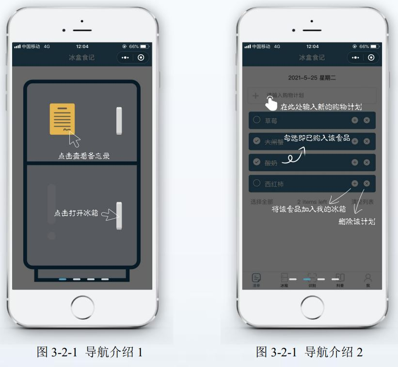

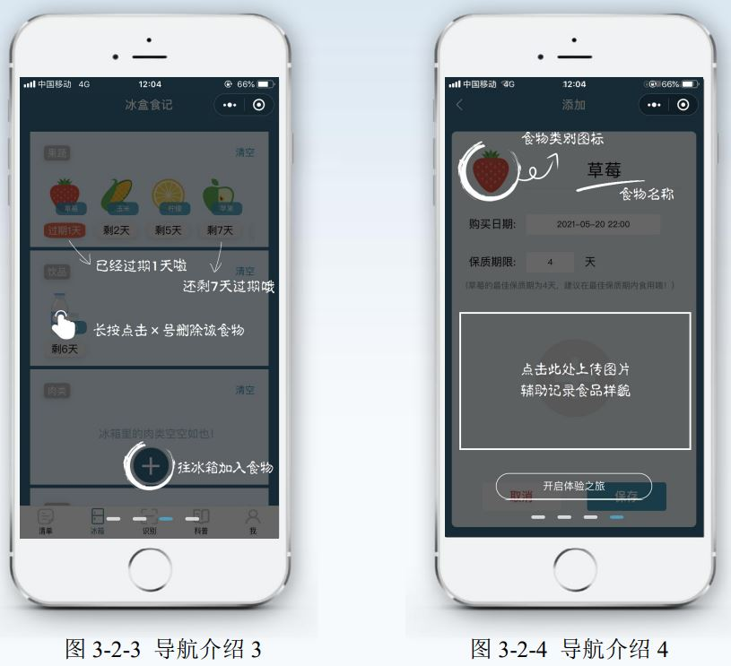

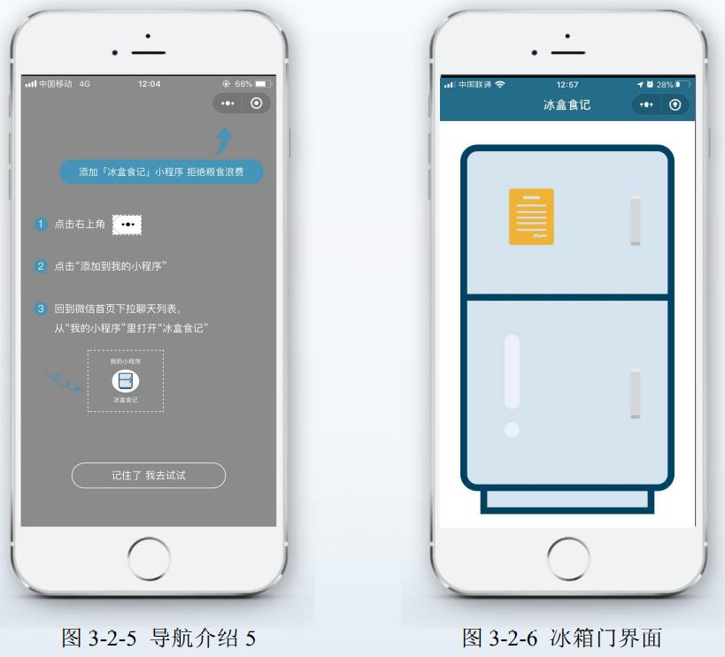

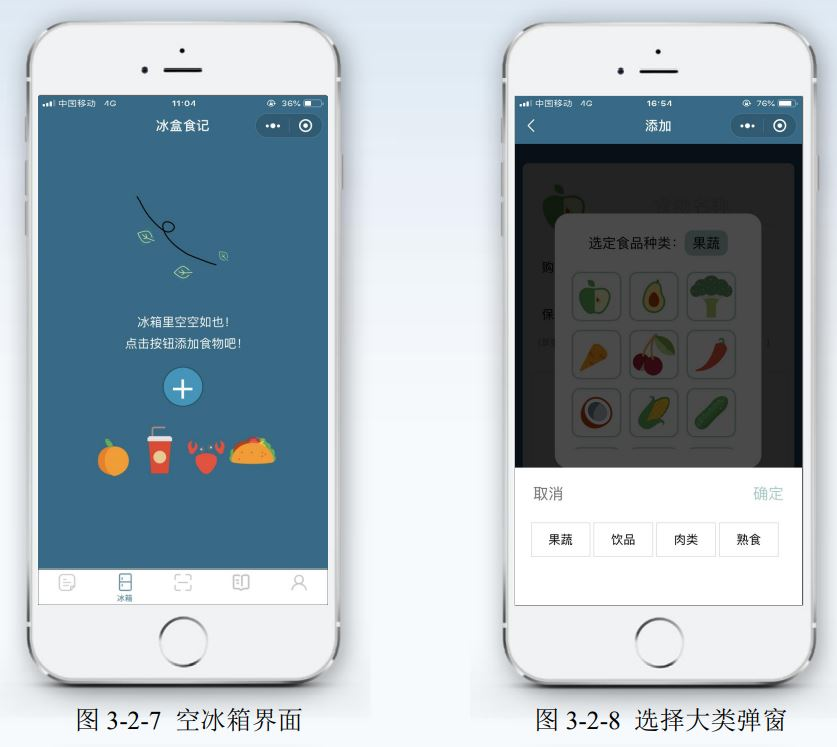

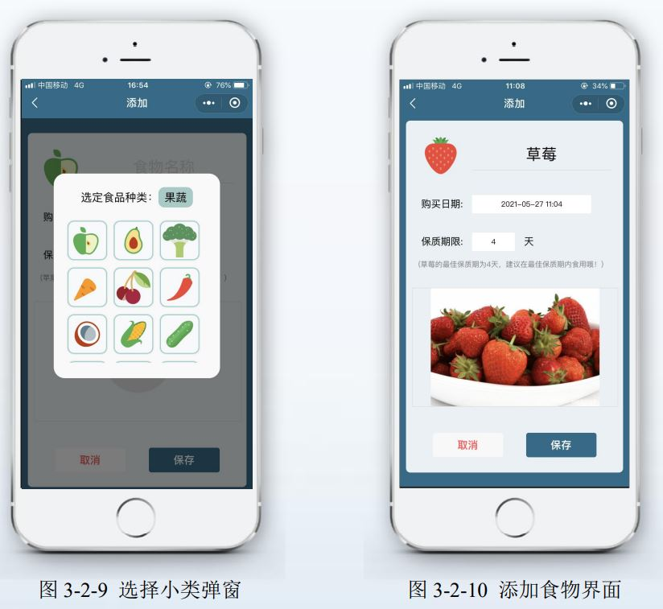

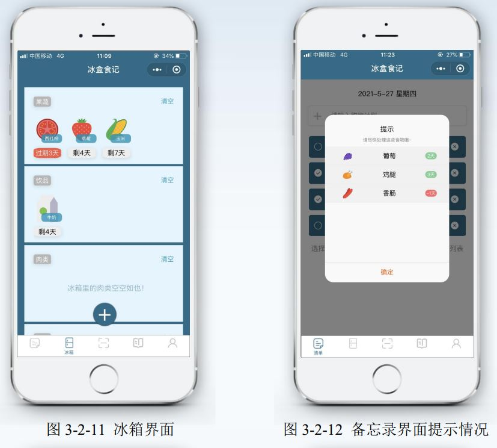

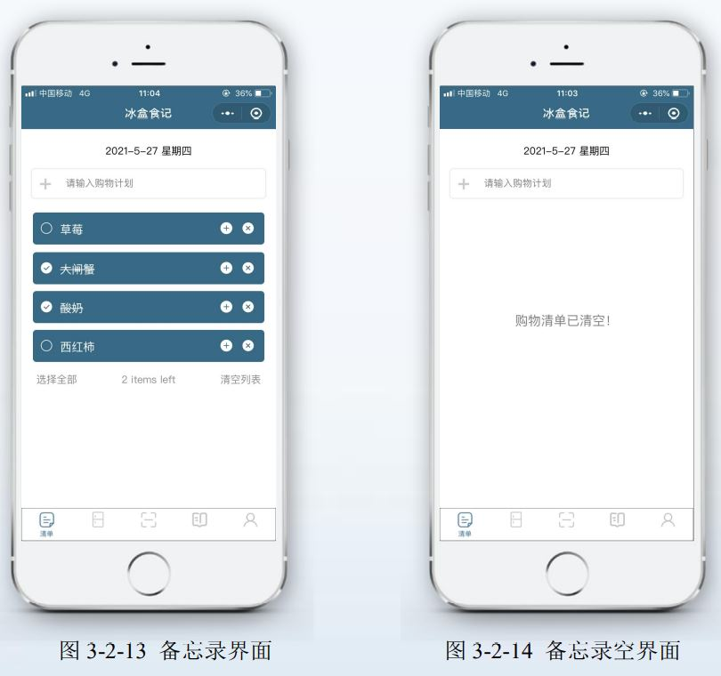

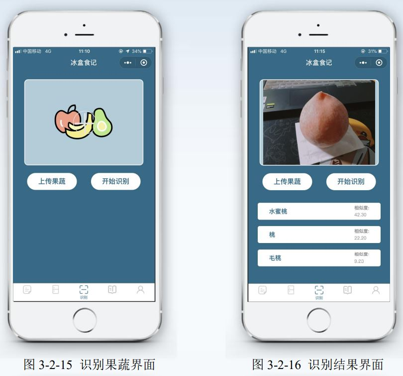

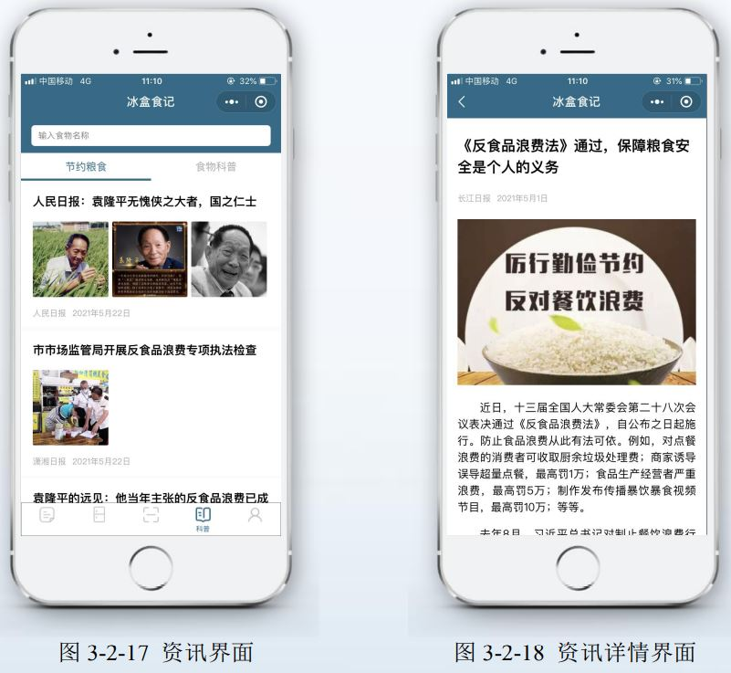

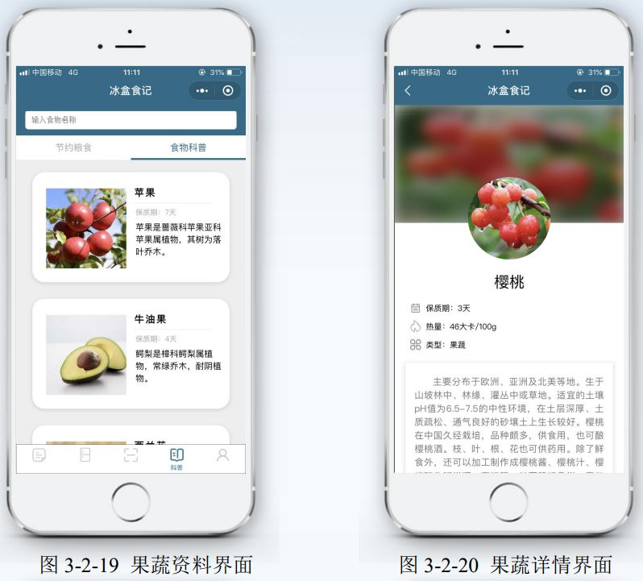

## 数据库结构 Database Structure：

### E-R结构分析 E-R structure analysis

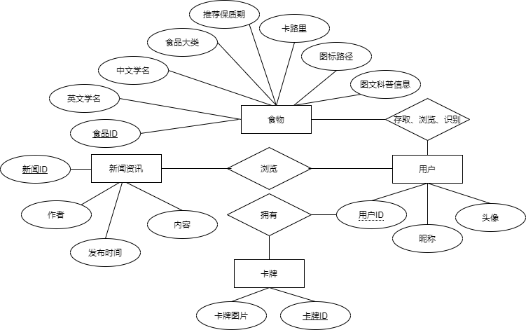

小程序中包含用户、卡牌、食品、新闻资讯实体，各个实体定义了若干属性。实体与实体之间相互联系，如用户可以存取食品、浏览食品科普信息、上传图片进行食品识别，用户可以通过累积的食品存取获得卡牌，用户还可以浏览与食品安全、食品浪费相关的新闻资讯，实体与实体之间关系紧密。
The applet contains user, card, food and news and information entities, each of which defines a number of attributes. The entities are interlinked with each other, e.g. users can access food, browse food science information, upload images for food identification, users can obtain cards by accumulating food access, users can also browse news and information related to food safety and food waste, and the entities are closely related to each other.

### 表结构分析 Analysis of table structure

冰盒食记小程序的数据字典中共8个数据库表，用户表User、食物表Food、食物存储情况表Store、正常食物处理表CountNor、正常食物处理表CountLeft、卡牌表Card、卡牌解锁情况表Unlock、新闻资讯表News。
There are 8 database tables in the data dictionary, User, Food, Store, CountNor, CountLeft, Card, Unlock, and News.
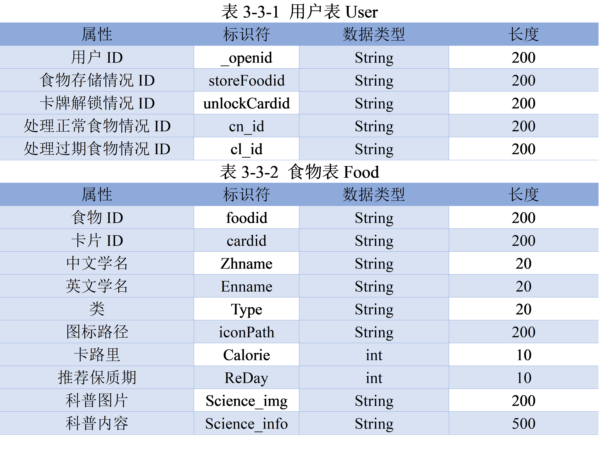

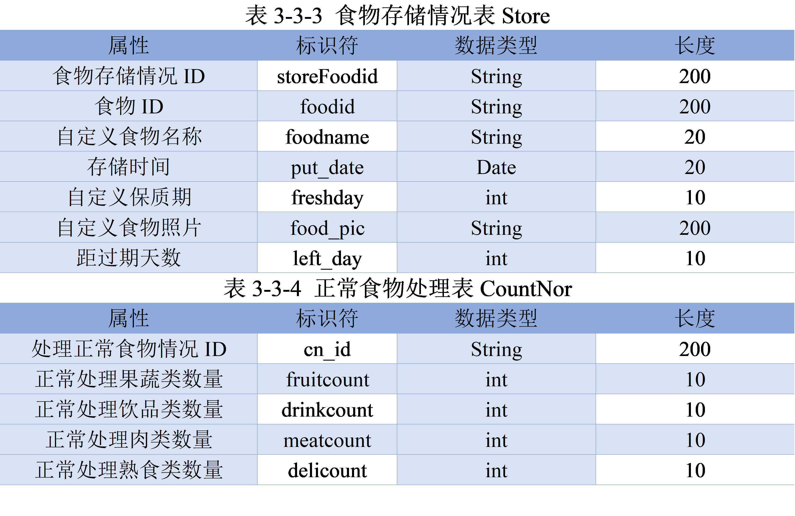

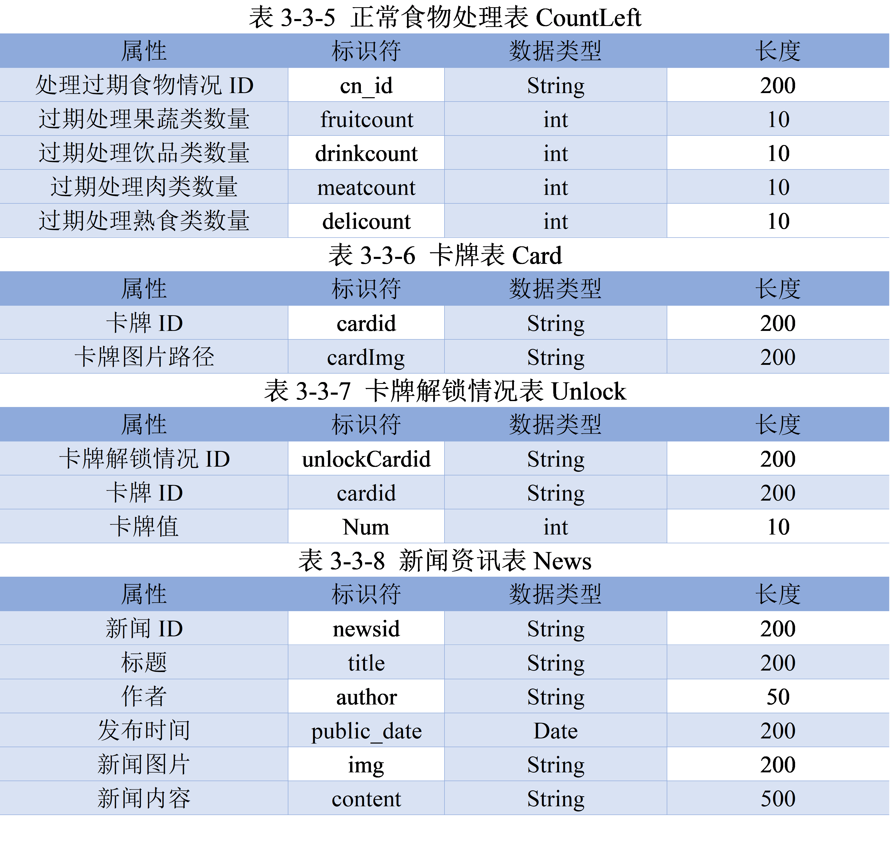

### 表间关系 Inter-table relationship

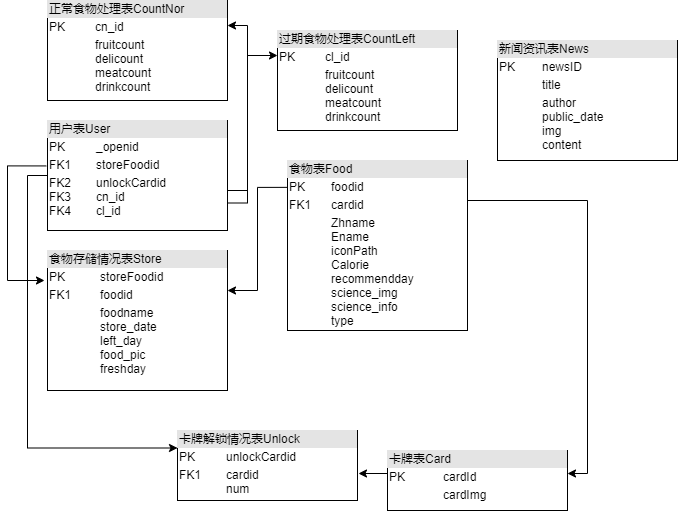
